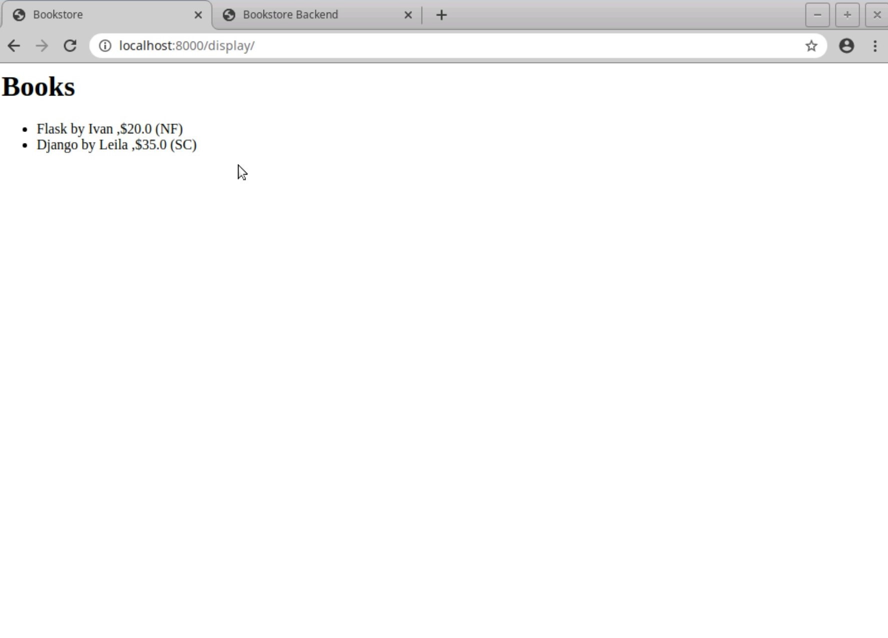
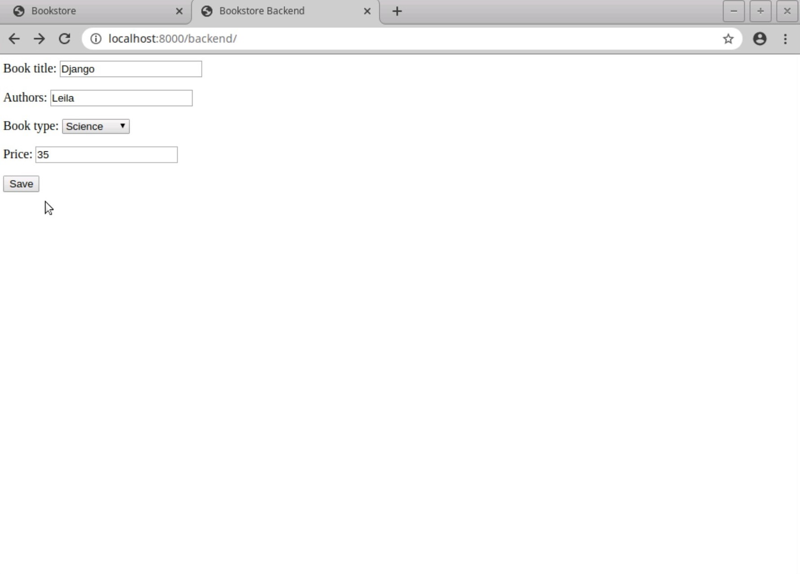

# Django Bookstore Application

[](https://www.djangoproject.com/)
[](https://www.python.org/)
[](LICENSE)

A lightweight web application for managing a bookstore's inventory, built with Django. This application provides a dual-interface system with separate frontend for customers and backend for administrators.

## 🚀 Features

- **Dual Interface System**
  - Customer-facing frontend to browse books
  - Admin-facing backend for inventory management
- **Book Management**
  - Add, view, and manage books
  - Support for multiple book categories (Fiction, Non-fiction, Science)
  - Track book details including title, author, type, and price
- **Data Validation**
  - Unique book title enforcement
  - Required fields validation
  - Price validation and formatting

## 📸 Screenshots
<table width="100%">
<tr>
<td width="50%"><strong>Customer-Facing Frontend Interface</strong></td>
<td width="50%"><strong>Administrator Backend Dashboard</strong></td>
</tr>
<tr>
<td></td>
<td></td>
</tr>
</table>

## 🛠️ Technology Stack

- **Backend**: Django 3.1.1
- **Database**: SQLite3
- **Frontend**: Django Templates
- **Forms**: Django Forms
- **Security**: Django CSRF Protection

## 📋 Prerequisites

- Python 3.6 or higher
- Django 3.1.1
- pip (Python package manager)

## ⚡ Quick Start

1. **Clone the repository**
   ```bash
   git clone https://github.com/yourusername/django-bookstore.git
   cd django-bookstore
   ```

2. **Create and activate a virtual environment**
   ```bash
   python -m venv venv
   source venv/bin/activate  # On Windows: venv\Scripts\activate
   ```

3. **Install dependencies**
   ```bash
   pip install django==3.1.1
   ```

4. **Apply database migrations**
   ```bash
   python manage.py makemigrations
   python manage.py migrate
   ```

5. **Create a superuser (Optional)**
   ```bash
   python manage.py createsuperuser
   ```

6. **Run the development server**
   ```bash
   python manage.py runserver
   ```

7. **Access the application**
   - Frontend: http://localhost:8000/display/
   - Backend: http://localhost:8000/backend/
   - Admin Interface: http://localhost:8000/admin/

## 🏗️ Project Structure
```
django-bookstore/
├── backend/                # Backend application
│   ├── forms.py            # Form definitions
│   ├── models.py           # Data models
│   ├── templates/          # Backend templates
│   └── views.py            # Backend views
├── frontend/               # Frontend application
│   ├── templates/          # Frontend templates
│   └── views.py            # Frontend views
├── bookstoreproject/       # Project settings
│   ├── settings.py         # Django settings
│   └── urls.py             # URL configurations
├── demo/                   # Demo images
└── manage.py               # Django management script
```

## 💡 Usage

### Backend Interface
1. Navigate to `/backend/`
2. Fill in the book details:
   - Book title (unique)
   - Author name
   - Book type (Fiction/Non-fiction/Science)
   - Price
3. Click "Save" to add the book to inventory

### Frontend Interface
1. Navigate to `/display/`
2. View the list of all books with their details
3. Books are displayed with title, author, price, and type

## 🔒 Security Features

- CSRF protection enabled
- Django's built-in SQL injection protection
- Form validation and sanitization
- Debug mode configuration
- Secure password hashing

## 🤝 Contributing

1. Fork the repository
2. Create your feature branch (`git checkout -b feature/AmazingFeature`)
3. Commit your changes (`git commit -m 'Add some AmazingFeature'`)
4. Push to the branch (`git push origin feature/AmazingFeature`)
5. Open a Pull Request

## 📝 License

This project is licensed under the MIT License - see the [LICENSE](LICENSE) file for details.

## ✨ Acknowledgments

- Django documentation and community
- Contributors and maintainers
- Python community

## 🔗 Links

- [Django Documentation](https://docs.djangoproject.com/)
- [Python Documentation](https://docs.python.org/)
- [SQLite Documentation](https://www.sqlite.org/docs.html)

## 📫 Contact

For support or queries, please open an issue in the GitHub repository.
